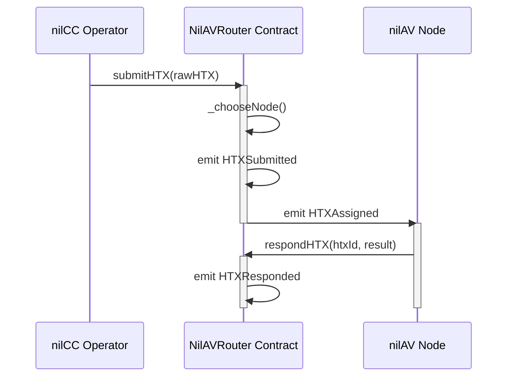

# Nillion Auditor-Verifier (nilAV) 

[](LICENSE)
[](https://github.com/NillionNetwork/nilAV/actions/workflows/build.yml)
[](https://github.com/NillionNetwork/nilAV/actions/workflows/docker.yml)

A Rust-based HTX (Hash Transaction) verification system with real-time WebSocket event streaming with low latency.

> **🚀 WebSocket-Only Architecture**: Eliminates polling delays with event-driven processing for instant HTX assignment and verification.

## Overview

NilAV is a decentralized verification network where nodes verify HTX (Hash Transaction) submissions from nilCC operators. The system uses a smart contract to coordinate node registration, HTX assignment, and verification results.

**How it works:**
1. **nilCC Operators** submit HTXs to the NilAVRouter smart contract
2. **Smart Contract** randomly assigns HTXs to registered nilAV nodes
3. **nilAV Nodes** receive assignments via WebSocket, verify the HTX, and submit results
4. **Verification** checks if nilCC measurements exist in the builder's trusted index

**Key Architecture:**
- **Smart Contract** (Solidity): NilAVRouter manages node registration and HTX assignment
- **Rust Binaries**: Four independent executables for different roles in the network
- **Event-Driven**: WebSocket streaming for real-time responsiveness

## Repository Structure

This repository contains:

- **`src/bin/nilav_node.rs`** - The verification node (run this to become a verifier)
- **`src/bin/nilcc_simulator.rs`** - Simulates a nilCC operator submitting HTXs
- **`src/bin/monitor.rs`** - Interactive TUI for monitoring network activity
- **`src/bin/contract_cli.rs`** - CLI for direct contract interaction
- **`contracts/nilav-router/`** - Solidity smart contract

---

## 🚀 How to Run a Node

Follow these steps to run your own nilAV verification node on the network.

### Prerequisites

1. **Install Rust** (latest stable version):
   ```bash
   curl --proto '=https' --tlsv1.2 -sSf https://sh.rustup.rs | sh
   ```

2. **Install Foundry** (needed to compile the NilAVRouter contract):
   ```bash
   curl -L https://foundry.paradigm.xyz | bash
   foundryup
   ```
   > Re-open your shell or `source ~/.foundry/bin/foundryup` so `forge` is on your `PATH`.

3. **Clone the repository**:
   ```bash
   git clone https://github.com/NillionNetwork/nilAV.git
   cd nilAV
   ```

4. **Compile the smart contract before building the Rust binaries**:
   ```bash
   cd contracts/nilav-router
   forge build
   cd ../..
   ```

5. **Build the native binaries**:
   ```bash
   cargo build --release
   ```

### Wallet Setup

#### 1. Initialize your node wallet

Run the node once to generate a fresh keypair and `.env` file. On the first launch the program stops after creating the wallet so you can fund it before proceeding:

```bash
cargo run --release --bin nilav_node
```

This prints your on-chain address and creates `nilav_node.env` with the private key and RPC defaults. **Back up this file and keep it secret.**

```bash
╔══════════════════════════════════════════════════════════════════════╗
║                  ✅  Account Created Successfully ✅                 ║
╠═════════════════════════╦════════════════════════════════════════════╣
║                 Address ║ 0x1234567890abcdef1234567890abcdef12345678 ║
╠═════════════════════════╬════════════════════════════════════════════╣
║                 RPC URL ║ https://rpc-nilav-shzvox09l5.t.conduit.xyz ║
╠═════════════════════════╩════════════════════════════════════════════╣
║                ❗ Please fund this address with ETH ❗               ║
╚══════════════════════════════════════════════════════════════════════╝
```

#### 2. Add the nilAV Network to your wallet

Configure MetaMask (or another wallet) so you can view and fund the node address:

| Field | Value |
|-------|-------|
| **Network Name** | nilAV Network |
| **RPC URL** | `https://rpc-nilav-shzvox09l5.t.conduit.xyz` |
| **Chain ID** | 78651 |
| **Currency Symbol** | ETH (Sepolia) |

#### 3. Fund the node wallet

Your node must hold ETH on the nilAV network to cover:
- Contract registration transactions
- HTX response submissions

Recommended balance: **≥ 0.1 ETH**. Bridge from another network or request funds from the NilAV team/faucet (if available), then verify the deposit in your wallet before proceeding.

#### 4. Run the node with the funded wallet

After confirming the deposit, start the verifier again:

```bash
cargo run --release --bin nilav_node
```

The node loads `nilav_node.env` automatically, registers with the contract if needed, and begins streaming HTX assignments.

**What happens next:**

1. ✅ Node connects to the blockchain via WebSocket
2. ✅ Checks your account balance (must have ETH for gas)
3. ✅ Auto-registers with the NilAV contract (if not already registered)
4. ✅ Listens for HTX assignments in real-time
5. ✅ Processes assignments: fetches HTX data → verifies → submits result
6. ✅ Earns verification fees (if implemented in contract)

### Monitoring Your Node

Watch your node logs for activity:

```
INFO Node initialized
INFO WebSocket connection established balance=0.5 ETH
INFO Node already registered
INFO HTX verified htx_id=0x123... verdict=VALID tx_hash=0xabc...
```

**Log Levels:**
- **INFO**: Normal operations (connections, HTX processing)
- **WARN**: Recoverable issues (reconnections, failed verifications)
- **ERROR**: Critical failures (out of gas, network issues)

For detailed logging:
```bash
RUST_LOG=debug cargo run --release --bin nilav_node
```

---

## Development & Testing

### Docker Images

Pre-built Docker images are automatically published to GitHub Container Registry (GHCR) with each release. You can pull and run them directly without building locally:

```bash
# Pull images
docker pull ghcr.io/nillionnetwork/nilav/nilav_node:latest
docker pull ghcr.io/nillionnetwork/nilav/nilcc_simulator:latest
docker pull ghcr.io/nillionnetwork/nilav/monitor:latest

# Run a node
docker run --rm \
  -e RPC_URL=https://rpc-nilav-shzvox09l5.t.conduit.xyz \
  -e CONTRACT_ADDRESS=0x4f071c297EF53565A86c634C9AAf5faCa89f6209 \
  -e PRIVATE_KEY=0xYourPrivateKey \
  ghcr.io/nillionnetwork/nilav/nilav_node:latest
```

See [docker/README.md](docker/README.md) for more details on using Docker images.

### Local Testing (Without Blockchain)

For local development without deploying to a blockchain, you can run a full simulation environment:

```bash
# Start local Ethereum testnet + nodes + simulators
docker compose up --build
```

This runs:
- **Anvil**: Local Ethereum testnet
- **5 nilAV nodes**: Automatically register and verify HTXs
- **2 nilCC simulators**: Submit HTXs every 5 seconds

### Other Tools

#### Monitor Network Activity (TUI)

Watch the network in real-time:

```bash
cargo run --release --bin monitor
```

Shows registered nodes, HTX submissions, assignments, and responses.

#### Contract CLI

Interact with the contract directly:

```bash
# List all registered nodes
cargo run --bin contract_cli -- list-nodes

# Register a specific address as a node
cargo run --bin contract_cli -- register-node 0xYourAddress

# Submit HTX from file
cargo run --bin contract_cli -- submit-htx data/htxs.json

# Get assignment info
cargo run --bin contract_cli -- get-assignment 0xHtxId
```

#### Simulate nilCC Operator

Submit HTXs to the contract periodically:

```bash
cargo run --release --bin nilcc_simulator
```

Reads HTXs from `data/htxs.json` and submits them round-robin every slot (configured in `config/config.toml`).

---

## HTX (Hash Transaction) Format

HTXs are JSON payloads that contain workload and measurement information:

```json
{
  "workload_id": {
    "current": 123,
    "previous": 12
  },
  "nilCC_operator": {
    "id": 4,
    "name": "My Cloud"
  },
  "builder": {
    "id": 94323,
    "name": "0xlala"
  },
  "nilCC_measurement": {
    "url": "https://nilcc.com/measurement/...",
    "nilcc_version": "v1.3.0",
    "cpu_count": 2,
    "GPUs": 1
  },
  "builder_measurement": {
    "url": "https://github.com/0xlala/measurements/..."
  }
}
```

### Verification Process

The node verifies an HTX by:

1. Fetching the nilCC measurement from `nilCC_measurement.url`
2. Extracting the measurement value (from `root.measurement` or `report.measurement`)
3. Fetching the builder's trusted measurement index from `builder_measurement.url`
4. Checking if the nilCC measurement exists in the builder's index
5. Submitting `true` if found, `false` otherwise

---

## Smart Contract Flow



**Events:**
- `HTXSubmitted(htxId, rawHTXHash, sender)` - New HTX submitted
- `HTXAssigned(htxId, node)` - HTX assigned to a node
- `HTXResponded(htxId, node, result)` - Node submitted verification result
- `NodeRegistered(node)` - New node registered
- `NodeDeregistered(node)` - Node removed

---

## Configuration

### Environment Variables

All binaries support configuration via environment variables or `.env` files:

| Variable | Description | Default |
|----------|-------------|---------|
| `RPC_URL` | Ethereum RPC endpoint | `http://localhost:8545` |
| `CONTRACT_ADDRESS` | NilAV contract address | `0x5FbDB2315678afecb367f032d93F642f64180aa3` |
| `PRIVATE_KEY` | Private key for transactions | Anvil test key |
| `RUST_LOG` | Log level (`error`, `warn`, `info`, `debug`, `trace`) | `info` |

### Config Files

- **`config/config.toml`** - Simulator slot timing and validator settings
- **`data/htxs.json`** - HTX payloads for testing

---

## Building & Testing

### Rust

```bash
# Build all binaries
cargo build --release

# Build specific binary
cargo build --bin nilav_node

# Run tests
cargo test

# Run tests with output
cargo test -- --nocapture

# Check compilation
cargo check
```

### Smart Contract (Foundry)

```bash
cd contracts/nilav-router

# Compile contract
forge build

# Run tests
forge test -vvv

# Format code
forge fmt
```

---

## Security Considerations

- **Private Keys**: Never commit private keys to version control. Use `.env` files (gitignored)
- **Gas Monitoring**: Monitor your account balance to ensure you don't run out of gas
- **Key Rotation**: Periodically rotate private keys for security
- **Hardware Wallets**: Consider using hardware wallets or key management services for production

---

## Contributing

Contributions are welcome! Please:

1. Fork the repository
2. Create a feature branch (`git checkout -b feature/amazing-feature`)
3. Commit your changes (`git commit -m 'Add amazing feature'`)
4. Push to the branch (`git push origin feature/amazing-feature`)
5. Open a Pull Request

---

## License

This project is licensed under the MIT License - see the [LICENSE](LICENSE) file for details.

---

## Support

- **Issues**: [GitHub Issues](https://github.com/NillionNetwork/nilAV/issues)
- **Documentation**: See [CLAUDE.md](CLAUDE.md) for detailed architecture documentation
- **Contact**: *[Team contact information]*

---

## Architecture Documentation

For detailed architecture information, development workflows, and advanced topics, see [CLAUDE.md](CLAUDE.md).